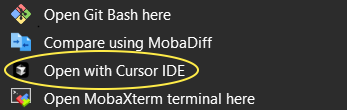

# Cursor IDE Context Menu

Este proyecto permite añadir una opción de menú contextual en el Explorador de Windows para abrir carpetas directamente con [Cursor IDE](https://www.cursor.sh/), tal como se hace con Visual Studio Code, pero adaptado a Cursor.

🚀 **Características principales:**

- Compatible con Windows 10 y 11
- Detecta automáticamente la instalación de Cursor
- Soporte multilenguaje (español, inglés, francés)
- Menú contextual con texto traducido:  
  - Español: *Abrir con Cursor IDE*  
  - Inglés: *Open with Cursor IDE*  
  - Francés: *Ouvrir avec Cursor IDE*
- Basado en un script de Inno Setup fácil de compilar

---

## ¿Por qué?

Cursor IDE, al ser un fork de VS Code, no incluye su propio menú contextual en Windows al instalarse. Este script resuelve esa limitación y mejora el flujo de trabajo de los desarrolladores.

---

## Instalación

1. Clona este repositorio:
   ```bash
   git clone https://github.com/lucho122/cursor-ide-context-menu.git

⚠️ Nota: Después de instalar, es posible que necesites reiniciar el Explorador de Windows
para que aparezca la nueva entrada del menú contextual. Para hacerlo rápidamente:
1. Pulsa Ctrl + Shift + Esc
2. Busca "Explorador de Windows"
3. Haz clic derecho → Reiniciar

## Capturas de pantalla

A continuación se muestra el menú contextual funcionando en Windows 11 (en “Mostrar más opciones”):


